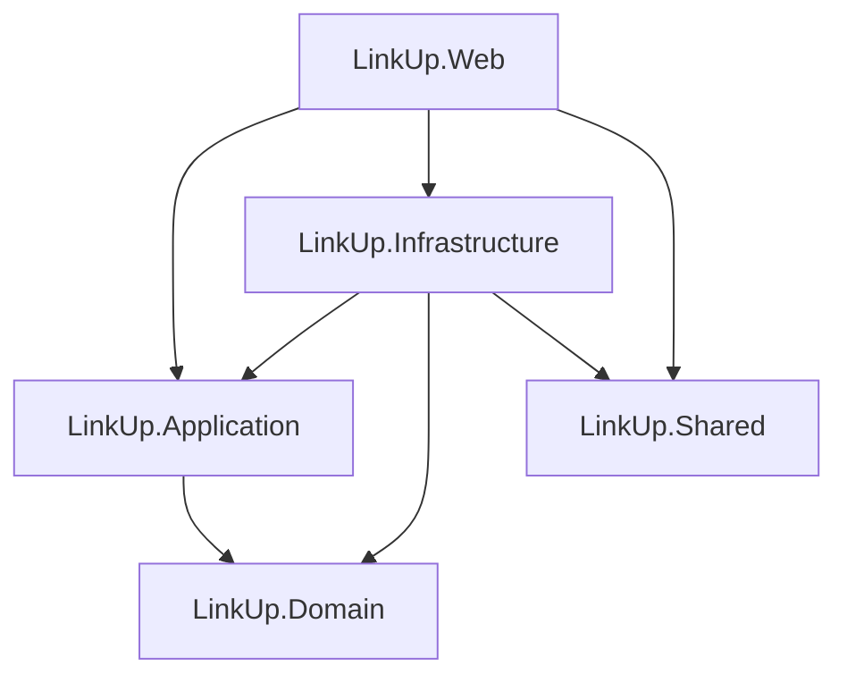

# LinkUp 🔗

Red social con juego de Battleship (Hundir la Flota) integrado, desarrollada en **ASP.NET Core MVC (.NET 8)** con arquitectura en capas (Onion/Clean Architecture).

Permite a los usuarios registrarse, publicar contenido (texto, imágenes y videos de YouTube), agregar amigos y retarlos a partidas de Battleship en tiempo real dentro de la misma plataforma.

---

## Tabla de contenido

- [Características](#características)
- [Arquitectura](#arquitectura)
- [Stack tecnológico](#stack-tecnológico)
- [Requisitos previos](#requisitos-previos)
- [Puesta en marcha](#puesta-en-marcha)
- [Configuración](#configuración)
- [Datos de prueba (Seed)](#datos-de-prueba-seed)
- [Estructura de controladores](#estructura-de-controladores)
- [Modelo de datos](#modelo-de-datos)
- [Diseño / UI](#diseño--ui)
- [Vulnerabilidades conocidas](#vulnerabilidades-conocidas)
- [Roadmap](#roadmap)

---

## Características

- **Autenticación y cuentas**: registro con activación de cuenta por email, login, recuperación y restablecimiento de contraseña, perfil editable con foto.
- **Publicaciones (Posts)**: crear, editar y eliminar publicaciones de texto, imagen o video de YouTube; reacciones (like/dislike) y comentarios anidados (con respuestas).
- **Amigos**: envío, aceptación y rechazo de solicitudes de amistad; listado de amigos; ver publicaciones de un amigo específico; eliminar amistad.
- **Battleship (Hundir la Flota)**: reta a un amigo, colocación de flota por turnos (5 barcos de distinto tamaño), tablero de ataque, historial de partidas, rendirse a mitad de juego y ver resultado final.
- **Sesión y seguridad**: cookies de autenticación, sesión con expiración, middleware que verifica que la cuenta siga activa en cada request, filtro global que inyecta el contador de solicitudes pendientes en el navbar.

## Arquitectura

El proyecto sigue una **arquitectura en capas (Onion)**: las dependencias siempre apuntan hacia el centro (`Domain`), nunca al revés.

```
LinkUp.Domain          → Entidades, Enums y clases base (BaseEntity, AuditableEntity). Sin dependencias externas.
LinkUp.Application     → DTOs, ViewModels, interfaces (Abstractions), servicios de negocio, mapeos (métodos de extensión manuales), resultados (Results).
LinkUp.Infrastructure  → EF Core (DbContext, Migrations), repositorios, envío de correo (MailKit), almacenamiento de archivos.
LinkUp.Shared          → Tipos compartidos entre capas (p. ej. opciones de email).
LinkUp.Web             → Controllers, Views (Razor), Middleware, Filters y assets estáticos (wwwroot).
```



## Stack tecnológico

| Categoría | Tecnología |
|---|---|
| Framework | ASP.NET Core MVC — .NET 8 |
| ORM | Entity Framework Core 8 (`Microsoft.EntityFrameworkCore.SqlServer`) |
| Base de datos | SQL Server (LocalDB en desarrollo) |
| Autenticación | ASP.NET Core Identity (`IdentityUser<int>` / `IdentityRole<int>`) |
| Mapeo objeto-objeto | Métodos de extensión manuales (`LinkUp.Application.Mappings.MappingExtensions`) |
| Envío de correo | MailKit (SMTP) |
| Frontend | Razor Views + Bootstrap + CSS propio (Design System LinkUp) + Font Awesome |

## Requisitos previos

- [.NET 8 SDK](https://dotnet.microsoft.com/download/dotnet/8.0)
- SQL Server LocalDB (incluido con Visual Studio) o una instancia de SQL Server accesible
- Herramientas de EF Core CLI:
  ```bash
  dotnet tool install --global dotnet-ef
  ```
- (Opcional) Credenciales SMTP si se quiere probar el envío real de correos de activación/recuperación de contraseña

## Puesta en marcha

Clona el repositorio y desde la raíz de la solución:

```bash
# Restaurar dependencias y compilar
dotnet build

# Aplicar migraciones y arrancar (las migraciones también se aplican
# automáticamente al iniciar la app vía Database.MigrateAsync())
cd LinkUp.Web
dotnet run
```

La aplicación quedará disponible en `https://localhost:5001` (o el puerto que indique la consola).

> Al arrancar por primera vez, el `DataSeeder` puebla la base de datos automáticamente si no existe ningún usuario — ver [Datos de prueba](#datos-de-prueba-seed).

### Regenerar la base de datos desde cero

Si necesitas partir de una base limpia (por ejemplo, tras cambiar el modelo o las migraciones):

```bash
cd LinkUp.Web
dotnet ef database drop --project ../LinkUp.Infrastructure --startup-project . -f
dotnet run
```

### Crear una nueva migración

```bash
cd LinkUp.Web
dotnet ef migrations add NombreDeLaMigracion --project ../LinkUp.Infrastructure --startup-project .
```

## Configuración

La configuración vive en `LinkUp.Web/appsettings.json`:

```json
{
  "ConnectionStrings": {
    "DefaultConnection": "Server=(localdb)\\mssqllocaldb;Database=LinkUp_Db;Trusted_Connection=True;MultipleActiveResultSets=true"
  },
  "EmailSettings": {
    "Host": "smtp.tuservidor.com",
    "Port": 587,
    "Username": "usuario",
    "Password": "contraseña",
    "FromEmail": "no-reply@linkup.com",
    "FromName": "LinkUp",
    "EnableSsl": true
  }
}
```

- **`ConnectionStrings:DefaultConnection`**: cadena de conexión a SQL Server / LocalDB.
- **`EmailSettings`**: credenciales SMTP usadas por `LinkUp.Infrastructure/Email` (MailKit) para los correos de activación de cuenta y restablecimiento de contraseña. En desarrollo pueden dejarse los valores de ejemplo si no se necesita probar el envío real.

## Datos de prueba (Seed)

`LinkUp.Infrastructure/Persistence/DataSeeder.cs` inserta datos de ejemplo automáticamente **solo si la tabla de usuarios está vacía**. Incluye:

- **6 usuarios activos**, todos con la contraseña `Pass-1111`:

  | Usuario | Email |
  |---|---|
  | `pruebas` | pruebas@linkup.com |
  | `alb3rtsontl` | alb3rtsontl@gmail.com |
  | `maria.gomez` | maria.gomez@linkup.com |
  | `carlos.reyes` | carlos.reyes@linkup.com |
  | `sofia.diaz` | sofia.diaz@linkup.com |
  | `juan.perez` | juan.perez@linkup.com |

- **Amistades ya aceptadas** entre varios de ellos, más una solicitud de amistad pendiente para probar la pantalla de solicitudes.
- **Publicaciones** de ejemplo (texto, imagen y video de YouTube) con reacciones y comentarios cruzados.
- **Una partida de Battleship en curso** (`pruebas` vs. `alb3rtsontl`) con ambas flotas ya colocadas y varios disparos ya realizados.
- **Una partida finalizada** (`maria.gomez` vs. `carlos.reyes`) para poblar el historial de juegos.

Para volver a ejecutar el seeder, primero hay que dejar la base de datos vacía (ver [Regenerar la base de datos](#regenerar-la-base-de-datos-desde-cero)), ya que se omite si ya existe al menos un usuario.

## Estructura de controladores

| Controlador | Responsabilidad |
|---|---|
| `AccountController` | Registro, login, logout, activación de cuenta, recuperación/restablecimiento de contraseña, perfil |
| `PostsController` | CRUD de publicaciones, reacciones y comentarios (incluye edición/borrado de comentarios) |
| `FriendsController` | Listado de amigos, ver publicaciones de un amigo, eliminar amistad |
| `FriendRequestsController` | Enviar, aceptar, rechazar y eliminar solicitudes de amistad |
| `BattleshipController` | Ciclo de vida completo de una partida: crear reto, colocar flota, atacar, rendirse, ver resultado |
| `HomeController` | Página de inicio y manejo de errores |

## Modelo de datos

Entidades principales (`LinkUp.Domain/Entities`):

- **`AppUser`** — extiende `IdentityUser<int>`; agrega nombre, apellido, teléfono, foto de perfil, estado de activación y tokens de activación/recuperación.
- **`Post`** / **`Comment`** / **`PostReaction`** — publicaciones, comentarios (con respuestas anidadas vía `ParentCommentId`) y reacciones (`Like` / `Dislike`).
- **`FriendRequest`** / **`Friendship`** — solicitudes de amistad (`Pending` / `Accepted` / `Rejected`) y amistades ya confirmadas.
- **`BattleshipGame`** / **`ShipPlacement`** / **`Attack`** — partida (con estado `WaitingPlacement` / `InProgress` / `Finished`), colocación de barcos por jugador y registro de cada disparo.

## Diseño / UI

El sistema visual ("LinkUp Design System") vive en `LinkUp.Web/wwwroot/css/site.css`, basado en variables CSS (`--lu-*`) sobre una paleta azul marino / dorado / turquesa, con:

- Componentes reutilizables: tarjetas, botones (`btn-primary`, `btn-gold`, `btn-teal`, `btn-ghost`, `btn-icon`...), badges de estado, toasts, tablero de Battleship, barra de navegación inferior para móvil, etc.
- Fondo de página con imagen (`wwwroot/img/background.png`) atenuada mediante un overlay en `body`.
- Header de login/registro con textura de puntos, blob decorativo y transición curva hacia el cuerpo de la tarjeta.
- Soporte preparado (no activado en UI) para modo oscuro vía `[data-theme="dark"]`.
- Respeta `prefers-reduced-motion` para usuarios sensibles a animaciones.

## Roadmap

- [ ] Notificaciones en tiempo real (SignalR) para invitaciones a partidas y mensajes de amigos
- [ ] Pruebas automatizadas (unitarias para `LinkUp.Application`, de integración para los controladores)

---

<p align="center">Hecho por Albertson Terrero López usando ASP.NET Core</p>